# YR3_WEB_PLATFORM_DEVELOPMENT_2

Web Platform Development 2 (M3I322955-18-B)

This project was developed on github because of this many of the branches are not visible on BitBucket, to see the changes of the project please visit [the git repository](https://github.com/bigteamseventeen/wbpd2_group_ah)

# Codebase

The application is split into two main projects. App and WFramework, As the name suggest we created a framework for the application. This allows us to split the project into two manageable sections. This framework focuses on Web, Session and Database ORM. We make use of Maven as the build process of the application and the packaging / deploying process of the application. The application was programmed to be developed without the need of a 3rd party CGI service like Apache or Tomcat. Should this application be used with Tomcat or Apache. Should the application be used within these services you need to use a ProxyPass inside Apache or the equivalent inside tomcat.

# How to run
Goto the releases section in github [here](https://github.com/bigteamseventeen/wbpd2_group_ah/releases/tag/1.0)

# How to compile 

To compile from scratch run the following commands (in order):
```
git clone https://github.com/bigteamseventeen/wbpd2_group_ah.git
cd wbpd2_group_ah

REM install the framework
cd WFramework
mvn install

REM Compile the app
cd ..
cd App
mvn package
mkdir bin

copy target/bts_g1_milestones-0.2-SNAPSHOT.jar bin
cd bin
del bts_g1_milestones-0.2-SNAPSHOT-shaded.jar
del original-bts_g1_milestones-0.2-SNAPSHOT.jar
ren bts_g1_milestones-0.2-SNAPSHOT.jar web2_group_ah.jar
```

The bin folder will now contain the web2_group_ah.jar, to run this just execute `java -jar web2_group_ah.jar`

# Report extract 

## Application Security

During the development of the application we also developed a framework to go alongside the application. This framework handles the generation of the SQL by creating a ORM (Object Relational Management) management class that handles the abstraction between the Database Model and the Database SQL. By doing this all of the queries are simple to execute and get quick results without having to worry about sql injection as in the backend of the code we use PreparedStatements.

This is a simple example query that looks for a planner where the id is *plannerId* and *user.getId()*. The sql for the query is generated and the query is executed. Any and all of the results from the ResultSet are parsed into the <T> object specified at the start of the QueryResults definition. The model objects are generated and to update a database model we do the same without having to write any SQL. Although if you want to write SQL you are still able to do such.

![][img_AppSecurity_QueryResults]

All of our view (html / templates) are automatically escaped because we are making use of the JTwig library which is a java implementation of the twig library. To escape and print text into the html you just surround the variable with curly braces {{ variable }}. This variable is automatically escaped and printed.

![][img_AppSecurity_ModelUpdate]

Any exceptions that occur during the application are printed to the user, if the application is being debugged a stack trace is displayed, if not just the simple error message is printed. When being debugged the error page looks like this:

![][img_AppSecurity_Exceptions]

This page is not visible if the application is being debugged, if the application is not being debugged only the first two lines are displayed, the extra card displaying the exception type, stack trace and developer note (extra info attached to the exception) are hidden.


Additionally to ensure there is no abuse of the application we implemented a small administration manage user section that will allow the adding of admins and the banning of user’s.

## The Application


| Section Name |                                          Description                                          |
|--------------|-----------------------------------------------------------------------------------------------|
| Console      | This contains all of the console commands that can be invoked by the user                     |
| Controllers  | These are all of the web request controllers, these handle all actions performed by the user. |
| Models (ORM) | This is all of the database related code. Object Relational Mapping.                          |
| Misc         | These are miscellaneous classes that don't relate to one of the main 3 sections.              |

When the application is first loaded up the Main class is invoked which will do 3 processes,
1) Setup the console instance, this will allow us to take in user input and commands,
2) Setup the database such as creating the SQL lite db, creating the tables,
3) Setup the server, sets the scanner package uri to search for web requests.


During stage 2, the database orm will create the tables (migration), the schema looks like: 
![][img_Application_DB]


During stage 3 the framework scans for all web requests, these are defined as Java Attributes like @GetRequest, @PostRequest.

These are displayed whenever the application boots:
![][img_Application_Boot]

The route is printed out in the format { RouteType } { URI } @ { Method }. This layout displays the method the route is mapped to and the uri. The chevron at the bottom of the console window is a interactive console command. This was used during development to help with database management.

![][img_Application_CMD]

## Additional Features

Additional Features
For additional features of the application we have done a few additions:

- Separate Framework to power the application
- Added and implemented a simple search system that will allow users to mark their planner as public which allows it to be visible when searching.
- A console command system with a few simple commands
- A section of the site dedicated to showing only the shared planners
- Implemented various advanced maven techniques such as adding a SHADE build of the jar to include all of the dependencies
- Created a exception handler which will display pretty printed error pages of the exception.

## Screenshots

A screenshot of the exception page with a NoSuchMethodError exception.
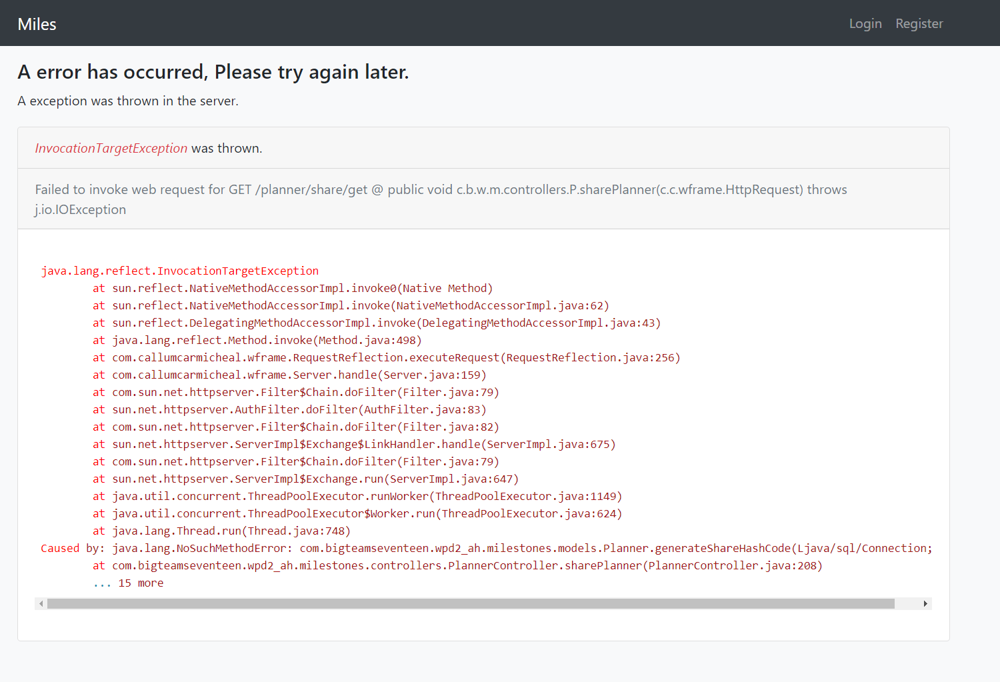

The below screenshot shows the page of our application that lets users create an account
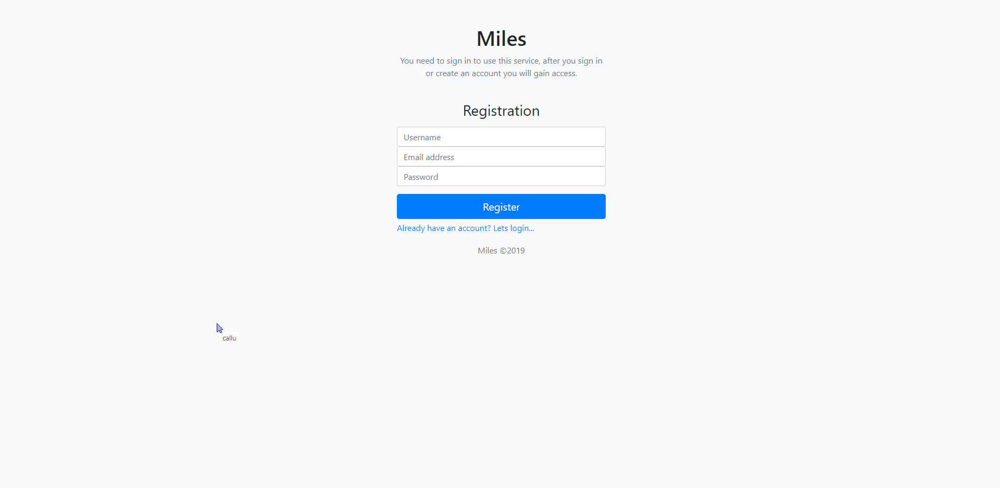

The below screenshot shows an account that has been successfully been created
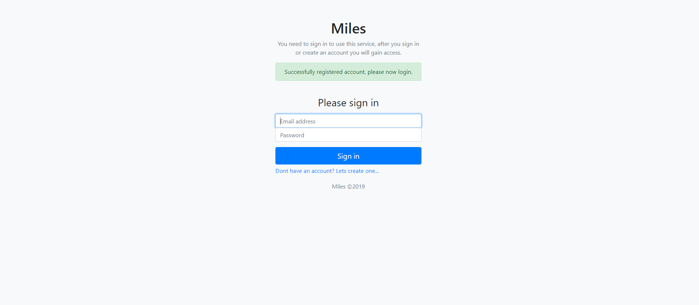

The below screenshot shows the page of our application that lets the user create a new planner.


The below screenshot shows the page of our application that lists the users planners
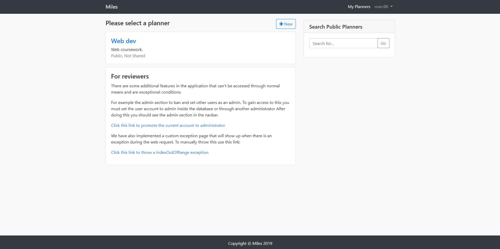

The below screenshot shows the page on our application that lets the user create a new milestone


The below screenshot shows data getting added to create a new
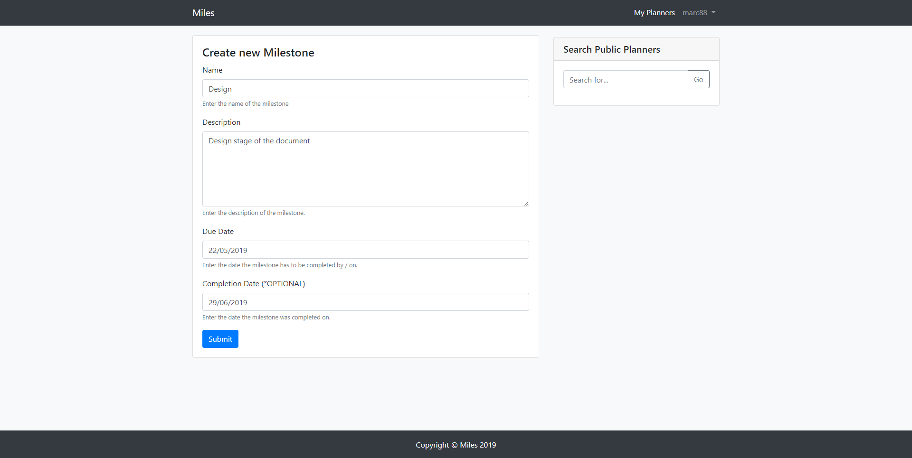

The below screenshot shows a list of milestones that are in a planner


The screenshot below displays that when the user makes the planner shared, the buttons change to display a simple icon to get the shared url and a second button to unshare the planner and invalidate the code.
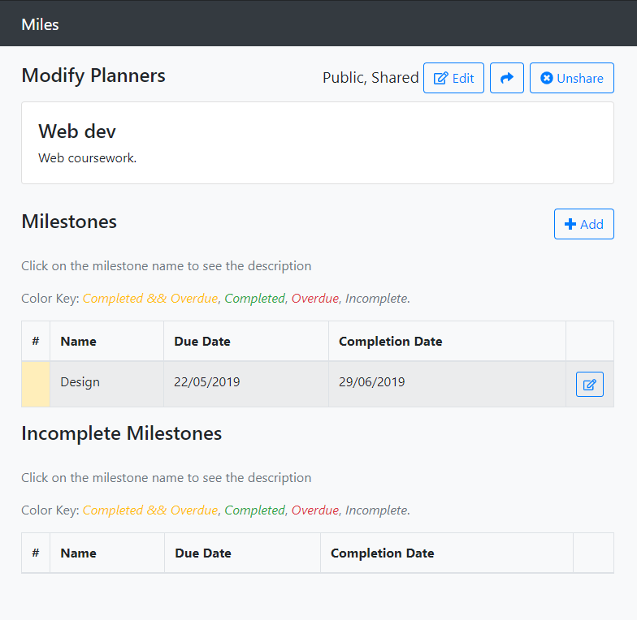

The below screenshot shows the search results of the user search “Web dev”
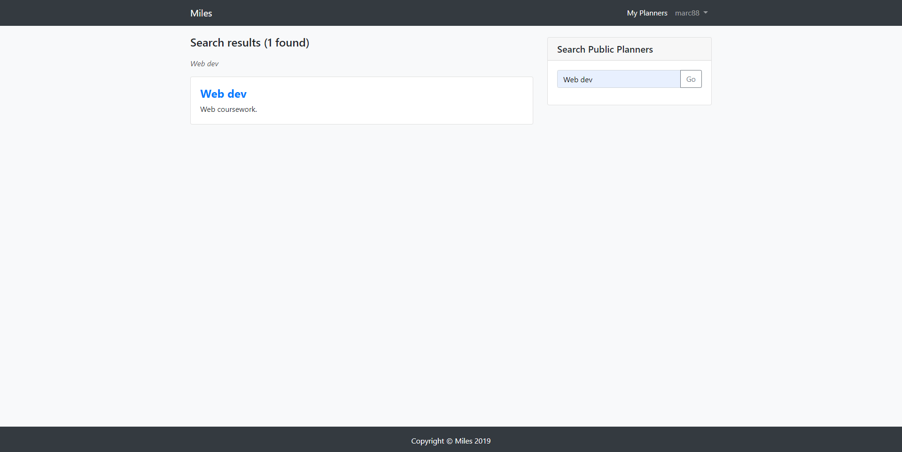

The below screenshot shows a user search that does not provide any results
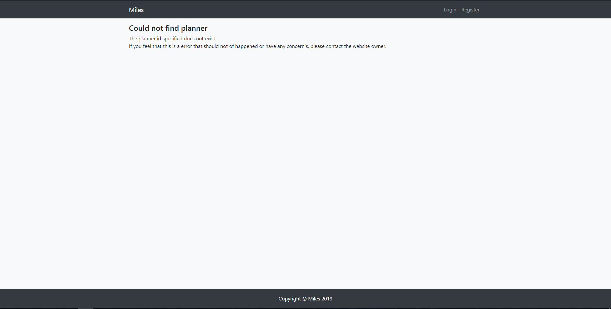

The below screenshot shows the users account options


The below screenshot is detailing the extra functionality that is available on the application
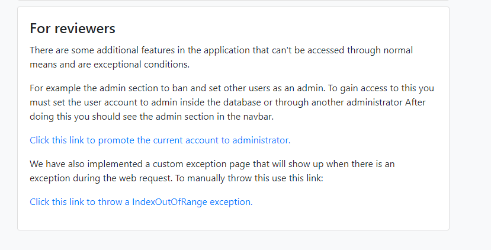

The below screenshot shows the options available to an administrator account


The below screenshot shows the page that allows admins to manage user accounts
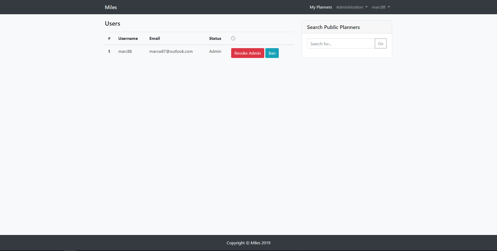

The below screenshot shows what is shown when a user tries to access something that they do not have permission for
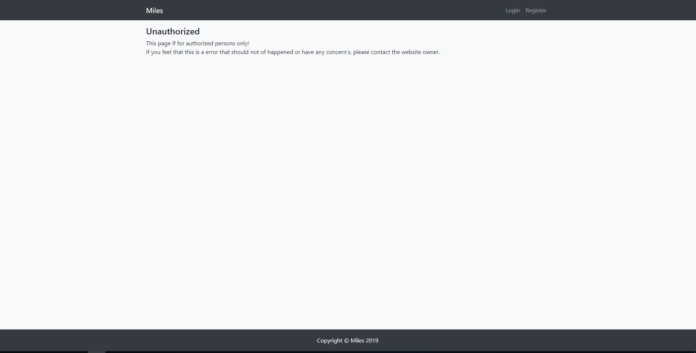

The below screenshot shows what happens when logging in on a banned account
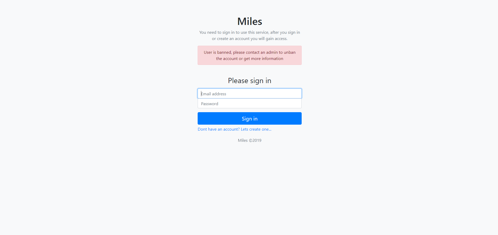

The below screenshot shows a list of available planners
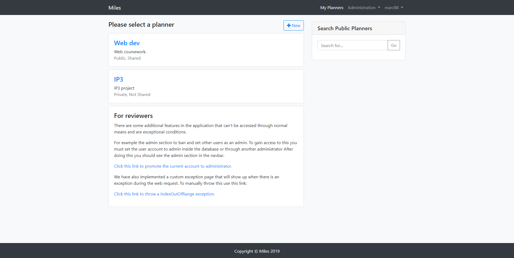

The below screenshot shows the page that allows the user to share their planners
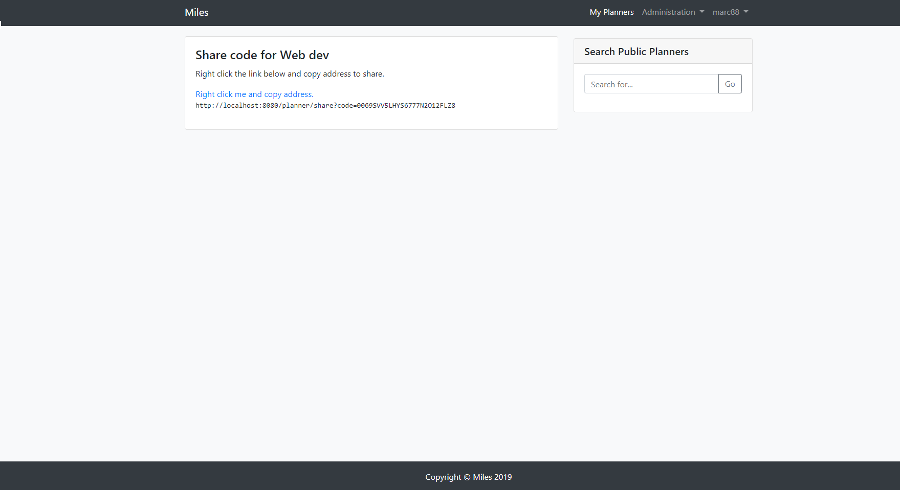

The below screenshot shows an extra function of the website


The below screenshot shows what happens when the above link is clicked
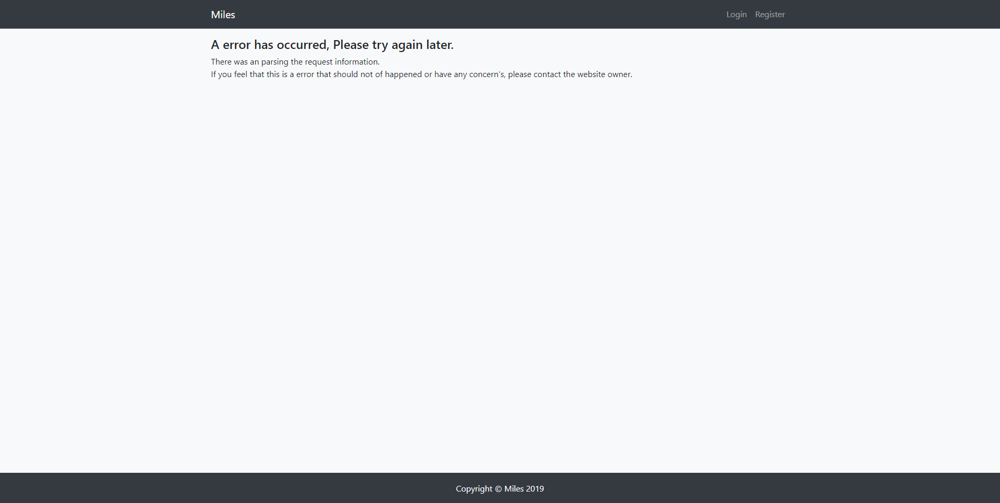

The below screenshot shows creating a milestone that is incomplete, (If the milestone’s date has been passed then the milestone is marked as incomplete).
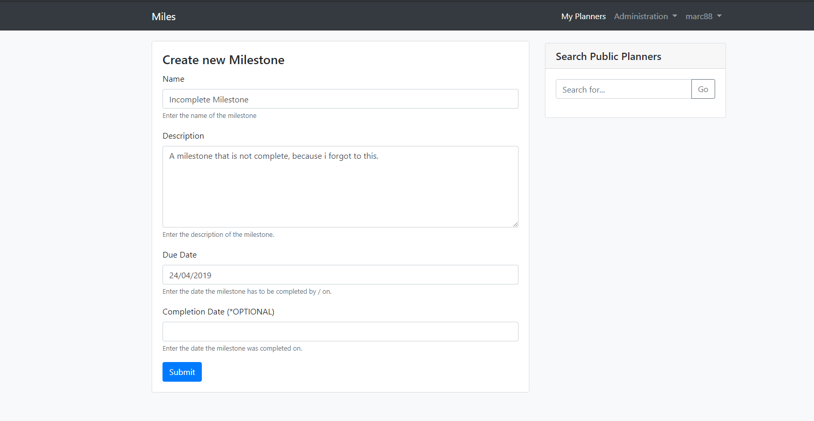

The below screenshot shows the milestones for a planner with the colour code
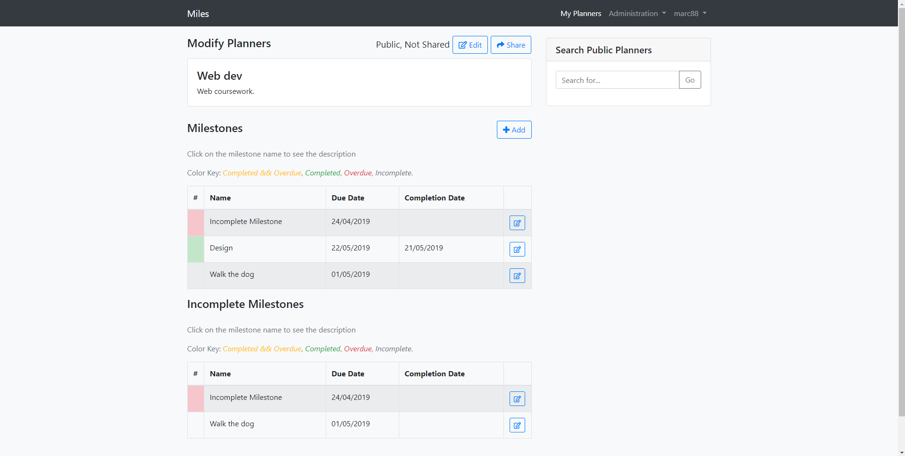
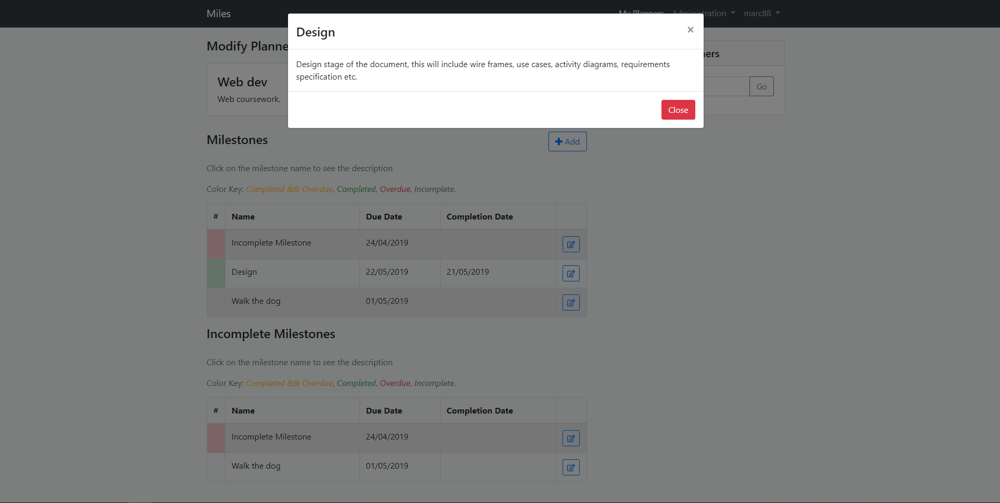

[img_AppSecurity_Exceptions]: Screenshots/image3.png "Exception Image"
[img_AppSecurity_QueryResults]: Screenshots/image6.png "Query Results"
[img_AppSecurity_ModelUpdate]: Screenshots/image18.png "Model Update"
[img_Application_DB]: Screenshots/image32.png ""
[img_Application_Boot]: Screenshots/image11.png ""
[img_Application_CMD]: Screenshots/image21.png ""
